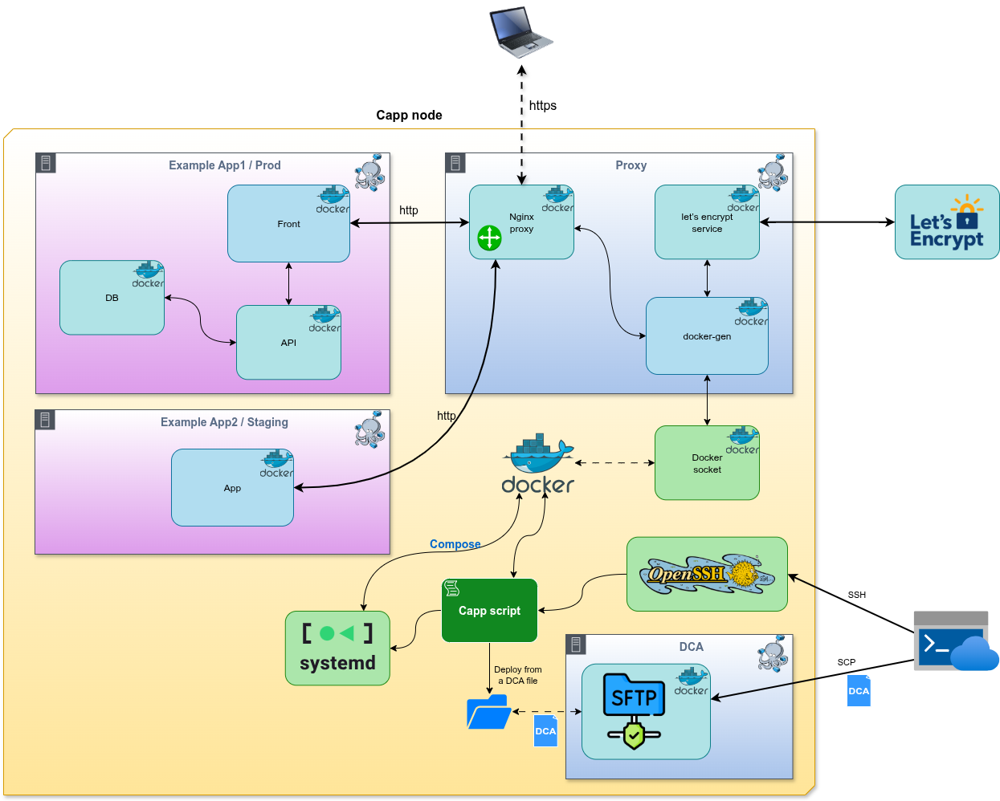

Capp
====

# In brief

- **Capp** (pronounced [see-app]) is a containerized application manager that deploys Docker Compose Archives ([DCA](#dca)) as per-environment systemd services
- It exposes apps via a dockerized nginx + docker-gen + letsencrypt stack by injecting `VIRTUAL_*` variables into compose services
- Access and operations are key-based over SSH and guarded by fine-grained rights per app/environment

## What it is and why it exists

Capp manages Docker Compose projects as first-class application instances, one instance per (app, environment) pair.

It exists to provide simple, auditable, reproducible deployments for fixed environments (dev, integ, staging, demo, prod), automatic HTTP vhost generation, and TLS provisioning without a heavyweight orchestrator.

## What it is not

- **Not** a cluster scheduler/orchestrator like Kubernetes — single-node, compose-based
- **Not** a CI/CD pipeline — it performs deployments but not build orchestration
- **Not** a multi-tenant PaaS; it runs per-node and exposes each app via the shared nginx proxy

# How to use

Deploy, inspect and operate apps with the capp CLI over SSH (key-based).

File transfer (upload DCA via special SSH container on port 122):

```bash
scp -P 122 myapp-1.0.dca dca@node:
```

Typical commands:

```bash
# List deployable archives (verify checksums)
capp dcas --check

# Deploy (and start) a DCA
capp deploy myapp-1.0.dca

# Deploy without starting
capp deploy myapp-1.0.dca --nostart

# Start / stop / restart
capp start myapp prod
capp stop myapp prod
capp restart myapp prod

# Show logs (pager; use --nopager to stream)
capp logs myapp prod
capp logs myapp prod --nopager

# Exec into a service container
capp exec myapp prod web -- bash -lc '"cd /app && ./manage.sh status"'

# Undeploy (keep data)
capp undeploy myapp prod

# Undeploy and remove volumes/images
capp undeploy myapp prod --all
```

# Architecture



1. Operator connects to the node via SSH (key-based). The same keys are used for the [DCA](#dca) transfer SSH endpoint (port 122) hosted in a dedicated container that only allows SFTP to a restricted DCA directory.
2. Operator runs `capp deploy <dca>` (SSH-only access). Capp validates the DCA metadata (app name, environment, hostnames, DCA version) and rights.
3. Capp extracts the DCA (a tar archive containing docker-compose.yml + metadata + context). It modifies the compose file to inject per-service variables:
   - `VIRTUAL_HOST`, `VIRTUAL_PORT`, `LETSENCRYPT_HOST`
4. Capp places the application compose project under `/etc/compose/<app>/<env>` and ensures the compose project joins the proxy docker network.
5. A systemd unit named `compose@<app>-<env>.service` is created/updated to manage the compose project lifecycle.
6. docker-gen (in a docker container) watches container labels/variables via the Docker socket, generates nginx vhost config, and reloads nginx.
7. letsencrypt container requests/renews certificates when `LETSENCRYPT_HOST` is set.
8. For runtime operations (logs, exec, start/stop), capp maps CLI actions to docker-compose / systemd commands while enforcing rights.

# Prerequisites

- Linux with **systemd**
- Root access for installation
- Tools: **Docker**, docker **compose**, **Python 3.9+**, python **yaml**, bash, openssh, tar, unxz, base64, curl, sudo, useradd/usermod
- Network: ports **80/443** reachable for HTTP/TLS (unless install used `--nohttps`)
- `/etc/compose` used to store deployed compose projects (apps live here)
- DCA uploads are done via the dedicated SFTP container on port 122 to `/home/deploy` directory

# Configuration

Main config file: `/etc/capp.conf` (key=value).

Important keys and defaults:

- `min_dca_version=2`
- `max_mem_size=10G`
- `max_proc=1000`
- `default_hostname=` (defaults to system hostname; recommended to set)

Note: `/etc/capp.conf` should be writable only by root.

# Installer

Install with the bundled installer script (run as root):

```bash
sudo ./capp-installer default_hostname your-email@example.com
# with options:
sudo ./capp-installer --min-dca-ver=2 --max-memory-size=2G --max-process=500 --nohttps myhost.example.com admin@example.com
```

Installer options summary:

- `--min-dca-ver=`
- `--max-memory-size=`
- `--max-process=`
- `--nohttps`
- `-v, --version`
- `-h, --help`
- `-e, --extract`

Email is used to configure letsencrypt.

# DCA

DCA means Docker Compose Archive

- DCA = tar archive of a docker-compose project + metadata file + optional context files
- Metadata must include: app name, environment (dev|integ|staging|demo|prod), hostnames, DCA version
- Capp enforces `min_dca_version`. See format spec: [*DCA*](https://github.com/jrd/dca_format)

# Deployment semantics

- `capp deploy <dca_file>` extracts archive into `/etc/compose/<app>/<env>`, injects `VIRTUAL_HOST/VIRTUAL_PORT/LETSENCRYPT_HOST` into exposed services, connects project to the proxy network, and creates a systemd unit `compose@<app>-<env>.service`
- `--nostart`: install without starting services
- `--clean`: stop and remove volumes before deploying

# Hooks — extending capp

Hooks are simple executable scripts placed in:

- `/etc/capp/hooks.d/pre_deploy`
- `/etc/capp/hooks.d/post_deploy`
- `/etc/capp/hooks.d/pre_undeploy`
- `/etc/capp/hooks.d/post_undeploy`

Execution:

- Any readable & executable file in those directories is run in lexical order
- Hook args (positional):
  1. app name
  2. environment
  3. DCA version
  4. path to the app docker-compose file
  5. path to the app directory

Example post deploy notifier:

`/etc/capp/hooks.d/post_deploy/notify.sh`

```bash
#!/usr/bin/env bash
set -e
APP="$1"; ENV="$2"; DCA_VER="$3"; COMPOSE="$4"; DIR="$5"
curl -fsS -X POST -H 'Content-Type: application/json' \
  -d "{\"app\":\"$APP\",\"env\":\"$ENV\",\"dir\":\"$DIR\"}" \
  https://internal.example.com/hooks/capp-deploy || true
```

Make executable:

```bash
sudo chmod +x /etc/capp/hooks.d/post_deploy/notify.sh
```

# Users, keys and rights

- Users are managed with `capp users` and authenticated by SSH public keys
- The same keyset is used for the dedicated SFTP container (port 122) for DCA uploads
- Rights are managed via `capp rights` and are scoped by `(RIGHT, ENV_REGEX, APP_REGEX)`
- Notable rights: `DCA_READ`, `DEPLOY`, `START`, `STOP`, `LOGS`, `EXEC`
- Systemd service naming: `compose@<app>-<env>.service`

Examples:

```bash
# on linux box, switch to the compose account:
su -s /bin/bash --login compose
capp users add alice "ssh-ed25519 AAAA..."
# alice will have all rights, so you can add more users through it.
```
Then, through ssh:

```bash
# list rights for a user
ssh deploy@node rights list --user alice
```

# Operational examples & common commands

List DCAs (verify checksums):

```bash
capp dcas --check
```

Deploy archive:

```bash
capp deploy /path/to/myapp-1.0.dca
```

Deploy but do not start:

```bash
capp deploy /path/to/myapp-1.0.dca --nostart
```

Start an app:

```bash
capp start myapp prod
```

Build images (if any):

```bash
capp build myapp prod
```

Logs (stream without pager):

```bash
capp logs myapp prod --nopager
```

Exec into service:

```bash
capp exec -u appuser -e RUNTIME=prod -w /app myapp prod web -- bash -lc '"ps aux"'
```

Undeploy (remove volumes/images):

```bash
capp undeploy myapp prod --all
```

# Troubleshooting

- Follow systemd unit logs for the compose unit:
```bash
journalctl -u "compose@myapp-prod.service" -f
```
- Capp runtime logs and compose logs:
```bash
capp logs myapp prod --nopager
```
- If nginx/vhost not present: check that `VIRTUAL_HOST` and network attachment were injected and that docker-gen container can read the Docker socket
- Certificate issues: confirm node outbound access to Let's Encrypt and that the installer email is valid
- Permission/rights errors: inspect with:
```bash
capp rights list --user youruser
```

Debugging tip:

- When deploying, tail the systemd unit and global supervisor logs simultaneously to see immediate failures:
```bash
journalctl -f -u "compose@*.service"
capp logs myapp prod --nopager
```

# Tests

Use `testindocker` script to test all this in a local docker.

- Use `ssh -p 1022 -o UserKnownHostsFile=/dev/null -o StrictHostKeyChecking=no root@127.0.0.1` (with password root) to spawn a shell within that container (`tmux` is available)
- Use `sudo su -s /bin/bash compose` to switch to compose user
- Use `capp users add your_user 'your_public_key'` to add your user with all rights
- Use `scp -P 1122 -O -o UserKnownHostsFile=/dev/null -o StrictHostKeyChecking=no test/myapp--prod.dca* dca@127.0.0.1:` to upload a sample dca file (and its checksum)
- Use `ssh -p 1022 -o UserKnownHostsFile=/dev/null -o StrictHostKeyChecking=no deploy@127.0.0.1 dcas --check` to check for dca file presence and correctness
- Use `ssh -p 1022 -o UserKnownHostsFile=/dev/null -o StrictHostKeyChecking=no deploy@127.0.0.1 deploy myapp--prod.dca` to deploy the application
- Check `http://myapp.test.capp`

# License and authors

[MIT](./LICENSE)

Authors:

- Cyrille Pontvieux
- David Garceries
- Samir Hachimi
